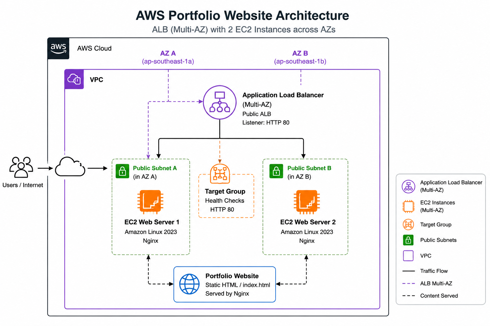
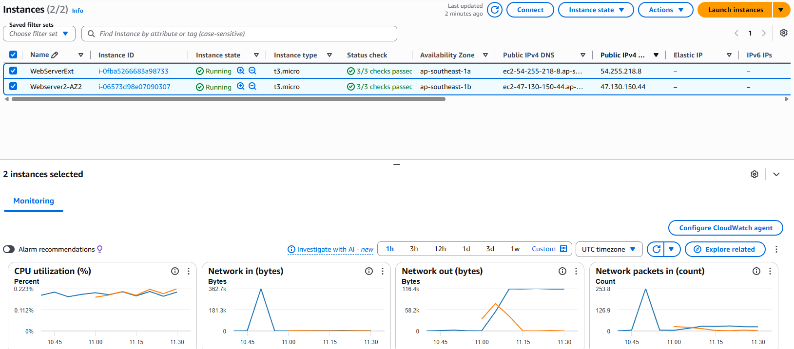
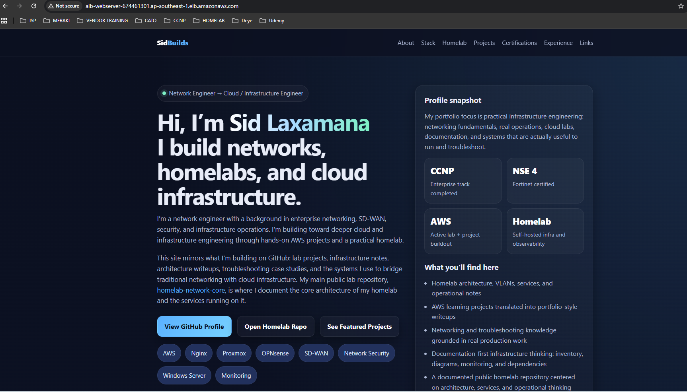
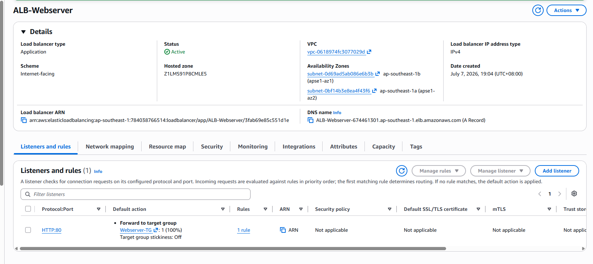
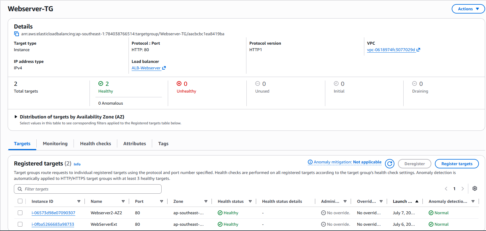
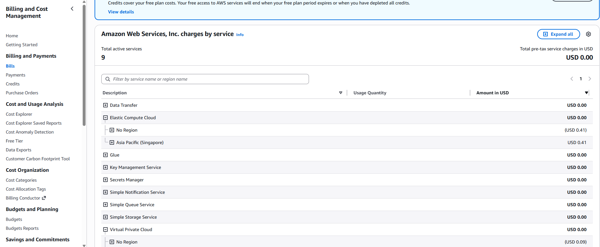

# AWS Portfolio Website on EC2 + Nginx + ALB

## Overview
This project documents the deployment of my personal portfolio website on AWS using **Amazon EC2** and **Nginx**, then extending it with an **Application Load Balancer (ALB)**. The goal was to build a public-facing site while using the project as a hands-on lab for AWS networking, load balancing, cost awareness, and security design decisions.

The project started as a simple EC2-hosted static website and evolved into a more production-style architecture with an ALB in front of the web server. Along the way, I used the lab to better understand **Internet Gateway vs NAT Gateway**, **ALB billing behavior**, **AWS WAF cost considerations**, and how the **AWS Free Plan / credits** interact with billable services.

---

## Architecture
**Internet → Application Load Balancer → EC2 (Amazon Linux + Nginx)**



### Current components
- **Amazon EC2** – hosts the website
- **Amazon Linux** – OS for the web server
- **Nginx** – serves the static portfolio site
- **Application Load Balancer** – fronts the website and forwards traffic to the instance
- **Target Group** – health-checks and routes traffic to the EC2 instance
- **VPC + Internet Gateway** – provides public connectivity
- **Security Groups** – control ALB and EC2 traffic flow

---

## Project goals
- Deploy a working public website on AWS
- Learn the basics of **EC2-based web hosting**
- Add an **ALB** to understand target groups, health checks, and load balancer behavior
- Understand AWS cost implications of common services used in small labs
- Turn the build process into a documented portfolio project rather than a one-off console exercise

---

## AWS services used
- **Amazon EC2**
- **Application Load Balancer (ALB)**
- **VPC**
- **Internet Gateway**
- **Security Groups**
- **Amazon Linux**
- **Nginx**
- **AWS Billing / Free Tier / Credits**
- **AWS WAF** *(tested briefly and removed to control cost)*

---

## What I built

### Phase 1 – Launch the website on EC2
- Launched an **Amazon Linux** EC2 instance
- Installed **Nginx**
- Replaced the default web page with a custom **HTML portfolio landing page**
- Verified public access to the website using the instance’s public address

### EC2 instance


### Website running on EC2 + Nginx


### Phase 2 – Put the website behind an ALB
- Created an **Application Load Balancer**
- Created a **target group**
- Registered the EC2 instance as a target
- Verified health checks and successful traffic flow through the ALB DNS name

### ALB listener configuration


### Target group health


### Phase 3 – Evaluate surrounding AWS design and cost decisions
- Compared **Internet Gateway vs NAT Gateway** in the context of public vs private workloads
- Reviewed **ALB billing** and understood that it can continue to incur charges while provisioned
- Tested / reviewed **AWS WAF** and WAF logging behavior, then removed it to avoid unnecessary cost for a low-traffic personal lab
- Checked **AWS Free Plan / credits** in the Billing console to understand what is actually covered and what can still consume credits

### Billing / Free Plan view


---

## Current architecture details

### Web server
- **Instance type:** `t3.micro`
- **OS:** Amazon Linux
- **Web server:** Nginx
- **Content:** static HTML portfolio page

### Load balancing layer
- **Application Load Balancer**
- Publicly reachable via AWS-generated ALB DNS name
- Forwards traffic to the EC2 target group

### Network path
- Internet traffic enters through the **ALB**
- ALB forwards traffic to the **EC2 instance**
- Website content is served by **Nginx**

---

## Operational observations and lessons learned

## 1) EC2 hosting is simple, but it exposes the full server lifecycle
This project was a good reminder that EC2-based hosting is more than “launch an instance and open port 80.” Even for a simple site, you still have to think about:
- Linux package installation
- web server configuration
- security group rules
- billing for the instance, storage, and public IP
- whether you actually need supporting AWS services like an ALB or WAF

---

## 2) Internet Gateway vs NAT Gateway matters a lot in cost and design
One of the useful side lessons in this project was understanding the difference between **Internet Gateway** and **NAT Gateway**.

### Internet Gateway
Use an **Internet Gateway** when you want a resource in a **public subnet** to have direct internet access, such as a public web server.

### NAT Gateway
Use a **NAT Gateway** when you want resources in a **private subnet** to reach the internet **outbound only** without being directly reachable from the internet.

### Practical takeaway from this lab
For a public Nginx web server, an **Internet Gateway** is the correct building block. A **NAT Gateway** is not only unnecessary for that role, but also expensive enough that it should not be created casually in a small lab.

---

## 3) ALB adds real architectural value, but it also changes the cost model
The ALB was not strictly necessary for a small personal website, but I added it to make the project more representative of a real AWS web architecture.

### What the ALB helped me learn
- target groups
- health checks
- traffic flow between ALB and EC2
- how to think about separating public entry points from backend instances
- the difference between “the site is reachable” and “the site is architected more like a real application entry layer”

### Cost awareness
The ALB also forced me to look at AWS pricing more closely. A load balancer can continue to incur cost while it exists, even if traffic is low. That was useful to understand early in the lab.

---

## 4) WAF is useful to understand, but not every service belongs in a small lab by default
I explored attaching **AWS WAF** to the ALB and looked at WAF logging to CloudWatch. I ultimately removed it because, for a low-traffic personal portfolio site, it was not worth the cost at this stage of the lab.

### What I took away
- WAF is a valid part of a production-grade edge architecture
- WAF and WAF logging should be evaluated deliberately, not just turned on “because security”
- in a small personal AWS lab, **cost discipline is part of architecture discipline**

---

## 5) “Free plan” does not mean every AWS service is safe to ignore
The AWS Billing console showed that my account is currently under the **AWS Free Plan with credits remaining**, but this project made it clear that “free account” does **not** mean “every service is free.”

### Practical lesson
Even when an account is protected by free-plan behavior or credits, services such as:
- ALB
- NAT Gateway
- WAF
- extra public IPv4 usage
- storage and snapshots

can still consume credits or become billable. I treated the AWS credit balance as a **lab budget** rather than assuming all experimentation was free.

---

## Cost considerations
This project was also a cost-awareness exercise.

### Resources that may incur ongoing cost
- **EC2 instance runtime**
- **Public IPv4**
- **EBS root volume**
- **Application Load Balancer**
- **ALB LCU usage**
- **Optional services like NAT Gateway and WAF**

### Cost-control actions taken
- avoided keeping NAT Gateway running unnecessarily
- removed WAF after testing
- checked Billing / Free Tier / Credits regularly
- treated the lab as something that should be documented **and** cost-managed

---

## Security considerations and next improvements
The current build works, but there are several improvements that would make it closer to a production-style design.

### Next steps I plan to add
- **Custom domain + Route 53**
- **HTTPS with ACM on the ALB**
- **HTTP → HTTPS redirect**
- Restrict the **EC2 security group** so it only allows inbound traffic from the **ALB security group**
- Move the web server into a **private subnet behind the ALB**
- Add a **Lambda-backed contact form**
- Rebuild the environment using **Terraform**

---

## Screenshots to include
I recommend adding these to a `screenshots/` folder:

- EC2 instance overview
- Nginx site working
- ALB listener configuration
- target group showing the instance as healthy
- Billing / Free Plan / credits page
- optional WAF screenshots if you want to document the experiment
- optional architecture diagram

---

## Repository structure
```text
aws-ec2-nginx-alb-portfolio-site/
├─ README.md
├─ index.html
├─ screenshots/
│  ├─ ec2-instance.png
│  ├─ nginx-site.png
│  ├─ alb-listener.png
│  ├─ target-group-healthy.png
│  └─ billing-free-plan.png
└─ diagrams/
   └─ aws-web-architecture.png
